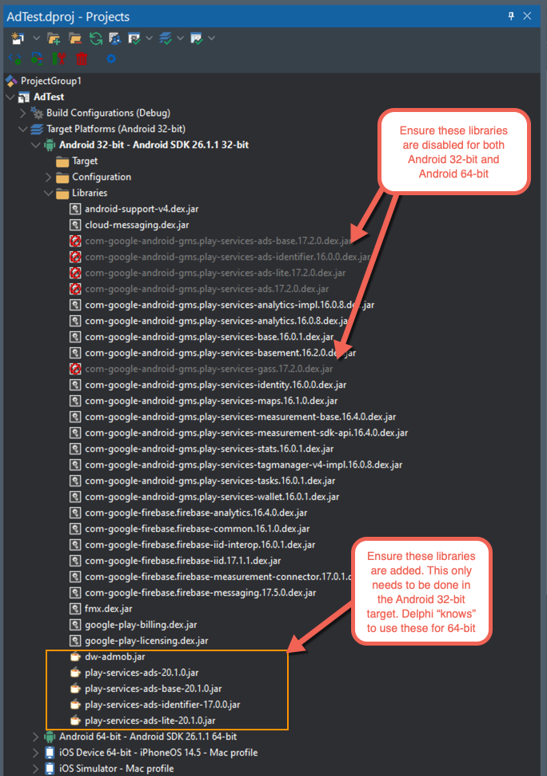

# AdMob Demo

## Description

Advertising implementation, specifically for AdMob (at present)

**NOTE: The demo has been updated (on July 26th, 2022) to align it with the Firebase iOS SDK v8.15.0**. See the [Libraries > iOS](#ios) section below.

## Project Configuration

### Component

**Please install the TAdMobBannerAd component first** (before even loading the demo)

The package can be found [here](https://github.com/DelphiWorlds/Kastri/tree/main/Packages/D110) 

### Libraries

#### Android

If creating your own project, you will need to add the [`dw-admob.jar`](https://github.com/DelphiWorlds/Kastri/blob/master/Lib/dw-admob.jar) file to the Libraries node under the Android platform in Project Manager

When using Delphi 10.4.x, you will need to add other libraries and disable some default libraries, as per this screenshot:

#### iOS

AdMob support in Kastri has now been aligned with the latest compatible version of the Firebase SDK for iOS, which is version 8.15.0. Please [download the SDK from here](https://github.com/firebase/firebase-ios-sdk/releases/download/v8.15.0/Firebase.zip), and unzip it somewhere, preferably in a folder that can be common to other projects that use the SDK. Create an [Environment Variable User System Override](https://docwiki.embarcadero.com/RADStudio/Alexandria/en/Environment_Variables) called Firebase, and set it to the folder where the SDK was unzipped to. This corresponds to the `$(Firebase)` macro in the Project Options of the demo.

### Android Entitlements

Ensure your project has the `AdMob Service` enabled. This adds Google Play services metadata and the Ads activity to the manifest.

### Android Permission

Ensure your project has the `Access Network State` permission in Project Options

### Using non-test Ad UnitIds

When configuring your app for non-test Ad UnitIds, you will need to:

* For Android: modify `AndroidManifest.template.xml` to add meta-data that includes your AdMob Application ID, as per part 3 of [these instructions](https://developers.google.com/admob/android/quick-start?hl=en-US#import_the_mobile_ads_sdk). Please refer to the image below for an example of where to put the meta-data. 
  

* For iOS: modify `info.plist.TemplateiOS.xml` to change the value for the `GADApplicationIdentifier` key. Please refer to the image below for an example of what to change. 
  

* Ensure that the `TestMode` property of the instances of AdMob classes is set to False, and the AdUnitId is set to a valid AdUnitId for your application.

## Delphi 10.4.x support

A [package has been created for Delphi 10.4.x](https://github.com/DelphiWorlds/Kastri/tree/main/Packages/D104), as well as a [demo](https://github.com/DelphiWorlds/Kastri/tree/main/Demos/AdMob/D104). Only RewardedAd has had very basic testing. **It is possible that something else might be broken, as some jars needed to be disabled.**

