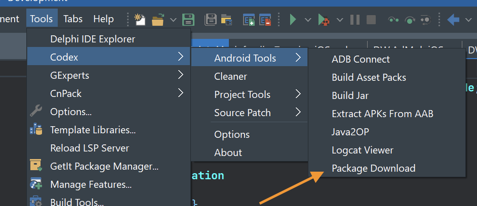
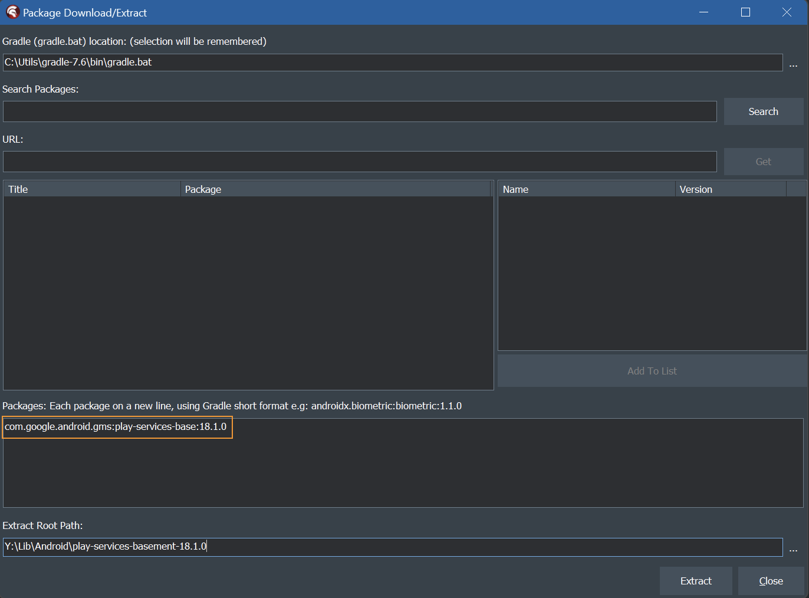
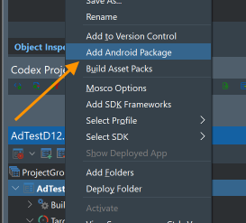
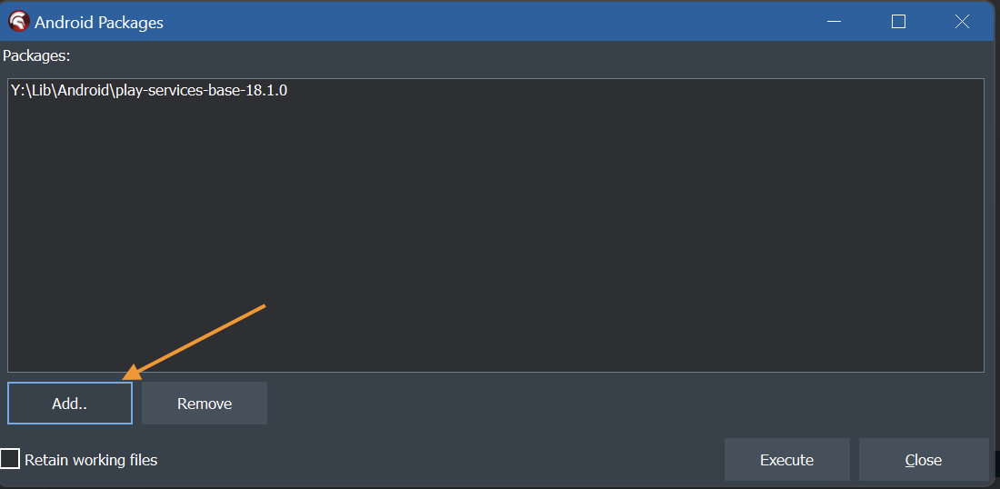
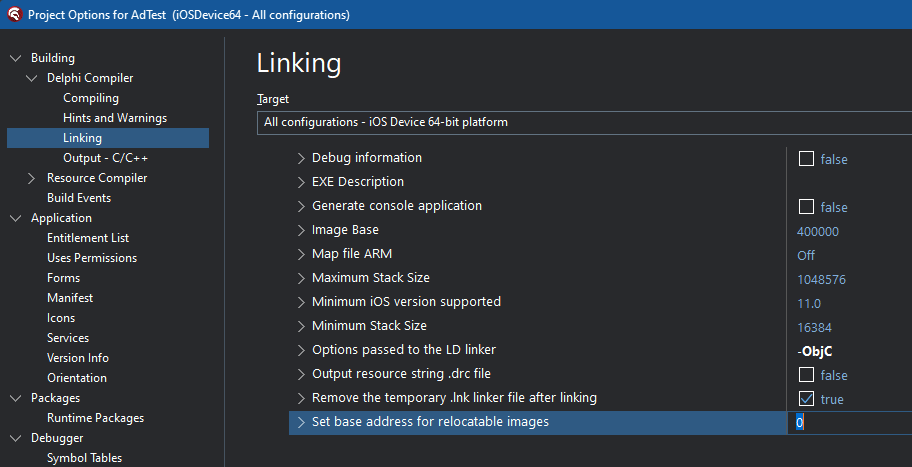
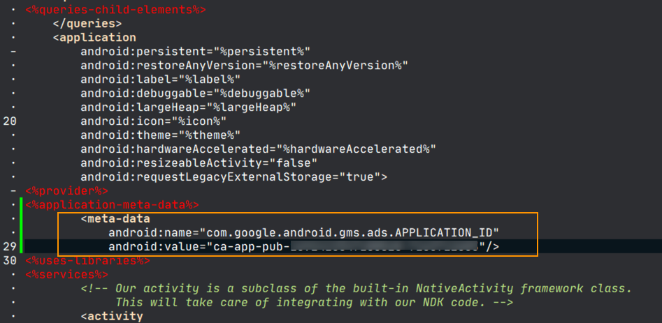
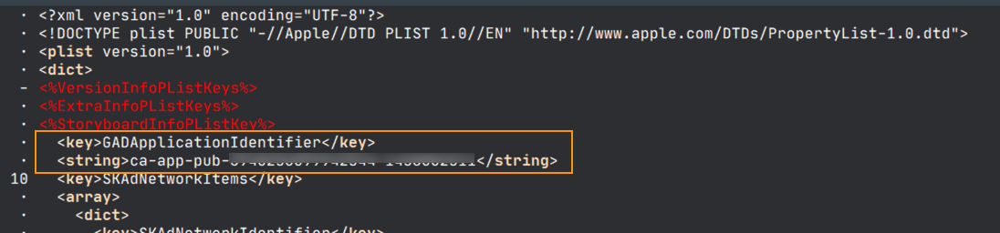

# AdMob Demo

## Description

Advertising implementation, specifically for AdMob (at present)

**UPDATE** -

Nov 25th, 2023: Support for User Messsaging Platform (UMP) has been added (Android support for **Delphi 12 only**, iOS support for Delphi 11.x and Delphi 12), which is required by Google in some geographic locations. This is **enabled by default**, and will require configuration in your [AdMob settings](https://apps.admob.com).

See [below](#user-messaging-platform-ump-support) for further information about the UMP support.

Nov 8th, 2023: Changed to align with the Firebase iOS SDK v10.8.0. See the [Libraries > iOS](#ios) section below.

## Supported Delphi versions

Delphi 12, Delphi 11.x.

**NOTE: The project for Delphi 12 is `AdTestD12.dproj` and the project for Delphi 11.x is `AdTest.dproj`**

## Project configuration

### Component

**Please install the TAdMobBannerAd component first** (before even loading the demo)

A package containing the component is available as [KastriAdMob.dproj](https://github.com/DelphiWorlds/Kastri/blob/master/Packages/KastriAdMob.dproj) in the Packages folder of Kastri.

### User Messaging Platform (UMP) support

As described in the update info, UMP support for Android is for **Delphi 12 only**. It should work on iOS for Delphi 12 and Delphi 11.x.

As [required by Google](https://support.google.com/admob/answer/10114014), if using AdMob, your app must show a consent message before ads can be shown. Kastri supports this via the `DW.AdMob` unit. Call RequestConsent when your app is ready to request constent.

```delphi
  AdMob.RequestConsent; // Call RequestConsent(True) to bypass UMP
```

While you are testing your app, you can use the following methods:

* `AdMob.SetDebugGeography` - this is used to simulate being in certain geographic locations. Presently there is just: `EEA` (European Economic Area) and `NonEEA` (aside from the `Disabled` option)
* `AdMob.SetTestDeviceHashedId` - sets an identifer used by UMP for testing. 
  
Before you actually use `SetTestDeviceHashedId`, when you run your app the value to be used will appear in the OS log messages which can be viewed using a log viewer. See [this link](https://github.com/DelphiWorlds/HowTo/tree/main/Solutions/LogViewers) for information about using log viewers. For Android, the message will appear in the logcat messages like this:

```
Use new ConsentDebugSettings.Builder().addTestDeviceHashedId("33BE2250B43518CCDA7DE426D04EE231") to set this as a debug device.
```

For iOS, the message will appear in the Console app like this:

```
<UMP SDK>To enable debug mode for this device, set: UMPDebugSettings.testDeviceIdentifiers = @[2077ef9a63d2b398840261c8221a0c9b]
```

In both cases, **all you need are the actual values** - please disregard the code examples in the messages.

You can use the `AdMob.ResetConsent` method to simulate a "first install" experience.

See the `TForm1.Create` method in the demo for examples.

### Android

#### Adding dependent libraries

If creating your own project, you will need to add the supporting library:

* For Delphi 11.x: [`dw-admob.jar`](https://github.com/DelphiWorlds/Kastri/blob/master/Lib/dw-admob.jar) 
* For Delphi 12: [`dw-admob-3.0.0.jar`](https://github.com/DelphiWorlds/Kastri/blob/master/Lib/dw-admob-3.0.0.jar)

to the Libraries node under the Android 32-bit platform in Project Manager

**Note**:

Due to a bug in **Delphi 11.3 ONLY**, if you need to compile for Android 64-bit, you will need to either apply [this workaround](https://docs.code-kungfu.com/books/hotfix-113-alexandria/page/fix-jar-libraries-added-to-android-64-bit-platform-target-are-not-compiled) (which will apply to **all** projects), **OR** copy the required jar file(s) to _another folder_, and add them to the Libraries node of the Android 64-bit target. (Adding the same `.jar` file(s) to Android 64-bit does _not_ work)

#### Generating a jar that contains R classes

This process is required only if you are **not disabling UMP support** ([see above](#user-messaging-platform-ump-support))

User Messaging Platform (UMP) requires `R` classes associated with the play-services-base-18.1.0.jar file that is part of the "default" libraries used by Delphi 12. When using Android Studio, these are generated automatically; with Delphi, they need to be generated separately. 

This process could be done manually via the command line or in a batch file, however an easier way is through the use of [Codex](https://github.com/DelphiWorlds/Codex). Once you install Codex, you can follow these steps:

1. Build and deploy your project at least once. This step is important for merging the resources Delphi creates, with resources in the Play Services Base library
2. From the Codex menu in Delphi, in the Android Tools section, use the Download Package function:

   
   
   ..to download/extract play-services-basement, using this value in the Packages edit:

   ```
   com.google.android.gms:play-services-base:18.1.0
   ```
   
   
   ..and click `Extract`

3. Right-click the project in Project Manager, and click `Add Android Package`:
   
   

   ..and add the folder that the package was extracted to in step 2:
   
   

   ..and click `Execute` to build the R classes for play-services-base and add the resulting jar to the project
   
4. Rebuild/deploy your project

This adds a library with the same name as the project, with an extension of `.R.jar`, to the Libraries node of the Android 32-bit target in Project Manager. If you compile for Android 64-bit, the jar will still be compiled in with your app.

### iOS

**UPDATE: Dec 21st, 2023**

The UMP support has now been modified to include App Tracking Transparency (ATT), so you will need to [modify the iOS SDK to add the `AppTrackingTransparency` framework](https://github.com/DelphiWorlds/HowTo/tree/main/Solutions/AddSDKFrameworks).

**UPDATE: Nov 8th, 2023**

AdMob support in Kastri has now been aligned with the latest compatible version of the Firebase SDK for iOS, which is version 10.8.0. Please [download the SDK from here](https://github.com/firebase/firebase-ios-sdk/releases/download/10.8.0/Firebase-10.8.0.zip), and unzip it somewhere, preferably in a folder that can be common to other projects that use the SDK. Create an [Environment Variable User System Override](https://docwiki.embarcadero.com/RADStudio/Alexandria/en/Environment_Variables) called `Firebase`, and set it to the folder where the SDK was unzipped to. This corresponds to the `$(Firebase)` macro in the Project Options of the demo.

In order to compile successfully for iOS, it's also necessary to:

1. Add [Swift Support Files in Delphi's SDK Manager](https://github.com/DelphiWorlds/HowTo/tree/main/Solutions/AddSwiftSupport) (follow the link for instructions)
2. Add the following frameworks to the iOS SDK in Delphi's SDK Manager (if they are not already added):

* Accessibility
* Combine
* AdServices
* CoreMotion
* DataDetection
* UniformTypeIdentifiers

[This link](https://github.com/DelphiWorlds/HowTo/tree/main/Solutions/AddSDKFrameworks) describes how to add the frameworks.

### Project Options

If creating your own project:

1. Set the Framework Search Path value for iOS Device 64-bit target to:
   ```
   $(Firebase)\FirebaseAnalytics\FBLPromises.xcframework\ios-arm64;$(Firebase)\FirebaseAnalytics\GoogleAppMeasurement.xcframework\ios-arm64_armv7;$(Firebase)\FirebaseAnalytics\GoogleAppMeasurementIdentitySupport.xcframework\ios-arm64_armv7;$(Firebase)\FirebaseAnalytics\GoogleUtilities.xcframework\ios-arm64;$(Firebase)\FirebaseAnalytics\nanopb.xcframework\ios-arm64;$(Firebase)\Google-Mobile-Ads-SDK\GoogleMobileAds.xcframework\ios-arm64_armv7;$(Firebase)\Google-Mobile-Ads-SDK\UserMessagingPlatform.xcframework\ios-arm64_armv7
   ```

2. Ensure you have a value of: `-ObjC -rpath /usr/lib/swift` for the `Options passed to the LD linker` option in the Project Options for iOS Device 64-bit:

   

### Android Entitlements

Ensure your project has the `AdMob Service` enabled. This adds Google Play services metadata and the Ads activity to the manifest.

### Android Permission

Ensure your project has the `Access Network State` permission in Project Options

### Using non-test Ad UnitIds

When configuring your app for non-test Ad UnitIds, you will need to:

* For Android: modify `AndroidManifest.template.xml` to add meta-data that includes your AdMob Application ID, as per part 3 of [these instructions](https://developers.google.com/admob/android/quick-start?hl=en-US#import_the_mobile_ads_sdk). Please refer to the image below for an example of where to put the meta-data. 
  


* For iOS: modify your projects `info.plist.TemplateiOS.xml` file to add the `GADApplicationIdentifier` key **and the array below it** from the `info.plist.TemplateiOS.xml` file _in the demo_, but change the _value_ for `GADApplicationIdentifier` to your AdMob Application ID. Please refer to the image below for an example of what to change. 
  


* Ensure that the `TestMode` property of the instances of AdMob classes is set to False, and the AdUnitId is set to a valid AdUnitId for your application.


