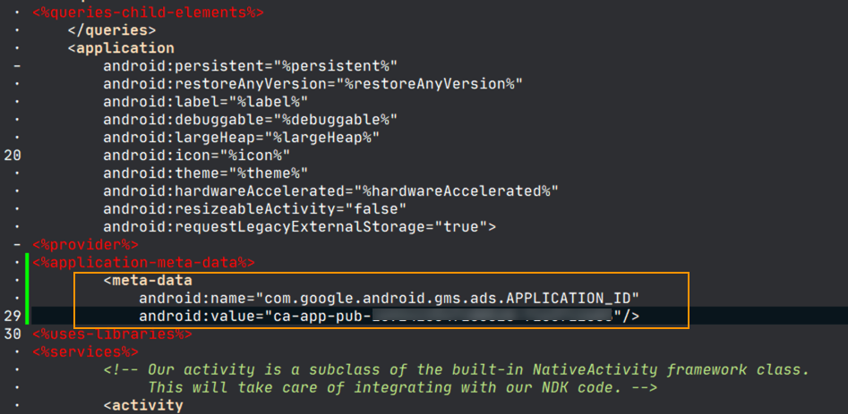
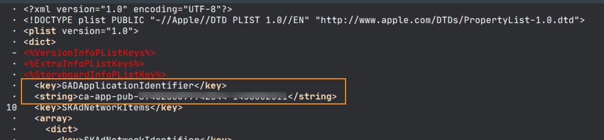

# AdMob Demo

## Description

Advertising implementation, specifically for AdMob (Google Mobile Ads)

Support for User Messsaging Platform (UMP) has been added, which is required by Google in some geographic locations. This is **enabled by default**, and will require configuration in your [AdMob settings](https://apps.admob.com).

See [below](#user-messaging-platform-ump-support) for further information about the UMP support.

## Supported Delphi versions

Delphi 13.x, 12.2 (Support for earlier than Delphi 12.2 has been dropped, as it is too complicated)

## Usage Notes

The "full screen" ad types:

* TInterstitialAd
* TRewardedInterstitialAd
* TRewardedAd
* TAppOpenAd

..have an option of performing the load of an ad, and showing an ad, all in one call by calling `Load` with no parameters, **OR** the load can be performed separately by calling `Load(False)`, and once the ad is loaded (which happens in the background), the `OnAdLoaded` event is called, and at that point the `Show` method can be called to show the ad.  

The latter method means that ads can be "preloaded" so that when it comes time to show an ad, it shows **immediately**.

The former method may result in a poor user experience, given that it takes a little while for the ad to load first, then be shown.

## Project configuration

### Component

**Please install the TAdMobBannerAd component first** (before even loading the demo)

A package containing the component is available as [KastriAdMob.dproj](https://github.com/DelphiWorlds/Kastri/blob/master/Packages/KastriAdMob.dproj) in the Packages folder of Kastri.

### User Messaging Platform (UMP) support

As [required by Google](https://support.google.com/admob/answer/10114014), if using AdMob, your app must show a consent message before ads can be shown. Kastri supports this via the `DW.AdMob` unit. Call `RequestConsent` when your app is ready to request constent.

```delphi
  AdMob.RequestConsent; // Call RequestConsent(True) to bypass UMP
```

While you are testing your app, you can use the following methods:

* `AdMob.SetDebugGeography` - this is used to simulate being in certain geographic locations. Presently there is just: `EEA` (European Economic Area) and `NonEEA` (aside from the `Disabled` option)
* `AdMob.SetTestDeviceHashedId` - sets an identifer used by UMP for testing. 
  
Before you actually use `SetTestDeviceHashedId`, when you run your app the value to be used will appear in the OS log messages which can be viewed using a log viewer. See [this link](https://github.com/DelphiWorlds/HowTo/tree/main/Solutions/LogViewers) for information about using log viewers. For Android, the message will appear in the logcat messages like this:

```
Use new ConsentDebugSettings.Builder().addTestDeviceHashedId("33BE2250B43518CCDA7DE426D04EE231") to set this as a debug device.
```

For iOS, the message will appear in the Console app like this:

```
<UMP SDK>To enable debug mode for this device, set: UMPDebugSettings.testDeviceIdentifiers = @[2077ef9a63d2b398840261c8221a0c9b]
```

In both cases, **all you need are the actual values** - please disregard the code examples in the messages.

You can use the `AdMob.ResetConsent` method to simulate a "first install" experience.

See the `TForm1.Create` method in the demo for examples.

### Android

#### Adding dependent libraries

If creating your own project, in Project Manager:

1. Expand Target Platforms
2. Expand **Android 32-bit**
3. Right-click the `Libraries` node and click `Add..`
4. Select `dw-admob-3.0.0.jar` from the `Lib` folder of Kastri and click Open
5. Repeat step 3, this time selecting the following files from the `ThirdParty\Android` folder of Kastri:
   * `play-services-ads-25.3.0.aar`
   * `play-services-ads-api-25.3.0.aar`
   * `play-services-ads-identifier-18.0.0.aar`
6. Right-click each of the following, and click `Disable` for each:
   * `play-services-ads-22.2.0.dex.jar`
   * `play-services-ads-base-22.2.0.dex.jar`
   * `play-services-ads-identifier-18.0.0.dex.jar`
   * `play-services-ads-lite-22.2.0.dex.jar`
7. Expand **Android 64-bit**
8. Under the `Libraries` node, repeat step 6 **ONLY** (i.e. no additions are required for Android 64-bit)

#### Android Entitlements

Ensure your project has the `AdMob Service` enabled in the Entitlement List in Project Options. This adds Google Play services metadata and the Ads activity to the manifest.

#### Android Permission

Ensure your project has the `Access Network State` permission in Project Options

#### Ad UnitIds

If you are using Ad UnitIds that are **not** for testing, please see [this section](#using-non-test-ad-unitids).

### iOS

#### AdMob Frameworks

The frameworks required for AdMob support on iOS have been re-packaged into a convenient folder structure, and [published in the binaries repo on Github](https://github.com/DelphiWorlds/Binaries/releases/tag/iOS-Arm64-AdMobFrameworks-v2.0.0).

Download the .zip file listed in the Assets section and unzip to a convenient folder.

**NOTE:** Using the AdMob Frameworks requires that the **minimum version of iOS be set to 13.0** (see [Linker Options](#linker-options))

In order to compile successfully for iOS, it's also necessary to:

1. **If using earlier than Delphi 13.0**, add [Swift Support Files in Delphi's SDK Manager](https://github.com/DelphiWorlds/HowTo/tree/main/Solutions/AddSwiftSupport) (follow the link for instructions)
2. Add the following frameworks to the iOS SDK in Delphi's SDK Manager (if they are not already added):

* Accessibility
* AdServices
* AppTrackingTransparency
* Combine
* CoreMotion
* CoreTransferable
* DataDetection
* MarketplaceKit
* Network
* SwiftCore
* SwiftUI
* UniformTypeIdentifiers

[This link](https://github.com/DelphiWorlds/HowTo/tree/main/Solutions/AddSDKFrameworks) describes how to add the frameworks.

### Framework search path

In the demo, this value is set to: `$(AdMob)`, which is a macro for an [Environment Variable User System Override](https://docwiki.embarcadero.com/RADStudio/Alexandria/en/Environment_Variables) called `AdMob` that is intended to point to the folder where the AdMob Frameworks are unzipped to. 

If you use this macro, you will need to create the User System Override in the **IDE** options. Otherwise, update the `Framework search path` value.

#### Linker Options

For `Minimum iOS version supported`, ensure the value is set to: `13.0`.

For the `Options passed to the LD linker` option in the Project Options for iOS Device 64-bit, ensure you have a value of: 
```
-ObjC -rpath /usr/lib/swift -weak_library /usr/lib/swift/libswift_Concurrency.dylib -weak_library /usr/lib/swift/libswift_StringProcessing.dylib -weak_library /usr/lib/swift/libswiftDataDetection.dylib -weak_library /usr/lib/swift/libswiftFileProvider.dylib -weak_library /usr/lib/swift/libswiftOSLog.dylib -weak_library /usr/lib/swift/libswiftXPC.dylib
``` 

The `-weak_library` entries ensure compatibility with iOS 15 or lower.

#### NSUserTrackingUsageDescription

Add a `NSUserTrackingUsageDescription` key and value to the info.plist.TemplateiOS.xml file. The value should be indicative of why your app requires user tracking. Since this is for AdMob, an example of this could be (as per the demo):

```xml
  <key>NSUserTrackingUsageDescription</key>
  <string>This app uses tracking data to help deliver ads that are relevant to you</string>
```

### Using non-test Ad UnitIds

When configuring your app for non-test Ad UnitIds, you will need to:

* For Android: modify `AndroidManifest.template.xml` to add meta-data that includes your AdMob Application ID, as per part 3 of [these instructions](https://developers.google.com/admob/android/quick-start?hl=en-US#import_the_mobile_ads_sdk). Please refer to the image below for an example of where to put the meta-data. 
  


* For iOS: modify your projects `info.plist.TemplateiOS.xml` file to add the `GADApplicationIdentifier` key **and the array below it** from the `info.plist.TemplateiOS.xml` file _in the demo_, but change the _value_ for `GADApplicationIdentifier` to your AdMob Application ID. Please refer to the image below for an example of what to change. 
  


* Ensure that the `TestMode` property of the instances of AdMob classes is set to False, and the AdUnitId is set to a valid AdUnitId for your application.
