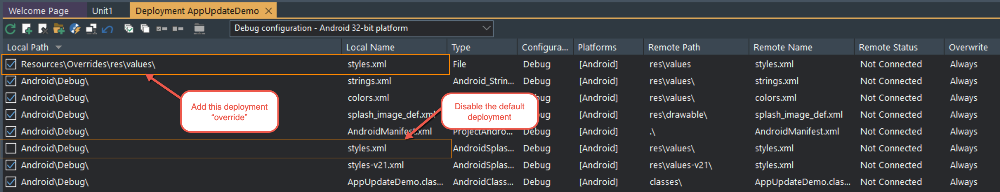

# App Update Demo

## Description

Demonstrates implementation of [in-app updating of Play Store apps on Android](https://developer.android.com/guide/playcore/in-app-updates). As such, this demo really only applies to Android.

Please refer to the demo as a guide on how to use `TAppUpdate`.

* `CheckForUpdate` is an **asynchronous** call to check if an update is available, and returns the info in the `OnAppUpdateInfo` event
* `StartUpdate` is an **asynchronous** call to start the update flow for the specified type. The `OnAppUpdateStartedFlow` event is called with the `Started` parameter indicating whether or not the flow did actually start. The `OnAppUpdateResult` event is called when the flow finishes, and the `UpdateResult` parameter indicates whether or not the update succeeded, or the user canceled.

## Supported Delphi versions

Delphi 12, Delphi 11.x. It _should_ also work in Delphi 10.4.2, and perhaps earlier.

## Project Configuration

These are instructions for configuring your own project to use the App Update feature

### Android libraries

This feature is dependent on the Play Services App Update library, which does not ship with Delphi. Add `app-update-2.1.0.jar` from the `ThirdParty\Android` folder in Kastri to the Libraries node of the Android 32-bit target in Project Manager.

**Note**:

Due to a bug in Delphi 11.3 **ONLY**, if you need to compile for Android 64-bit, you will either need to apply [this workaround](https://docs.code-kungfu.com/books/hotfix-113-alexandria/page/fix-jar-libraries-added-to-android-64-bit-platform-target-are-not-compiled) (which will apply to **all** projects), **OR** copy the jar file(s) to _another folder_, and add them to the Libraries node of the Android 64-bit target. (Adding the same `.jar` file(s) to Android 64-bit does _not_ work)

### Android Manifest/Deployment

Steps:

1. Deploy the project *at least once* - this will create the required manifest template and styles files
2. Modify `AndroidManifest.template.xml` to add *before* `<%activity%>`
   ```
    <activity android:name="com.google.android.play.core.common.PlayCoreDialogWrapperActivity"
        android:enabled="false"
        android:exported="true"
        android:stateNotNeeded="true"
        android:theme="@style/Theme.PlayCore.Transparent" />
   ```
1. Copy `styles.xml` and `styles-v21.xml` from the project output folder to the `Resources\Overrides\res\values` folder
2. Modify **each** of these files to add this style inside the `<resources>` tag:
   ```
    <style name="Theme.PlayCore.Transparent" parent="android:Theme">
      <item name="android:windowIsTranslucent">true</item>
      <item name="android:windowBackground">@android:color/transparent</item>
      <item name="android:windowContentOverlay">@null</item>
      <item name="android:windowNoTitle">true</item>
      <item name="android:windowIsFloating">true</item>
      <item name="android:backgroundDimEnabled">false</item>
    </style>
    ```
3. If you are creating your own project, these files will need to be added to the deployment (they are already added in the demo), for the target platforms (i.e. Android 32-bit and Android 64-bit) and configurations (e.g. Debug and Release). See the next step for an illustration of the required entries
4. As these files are an "override", the **Delphi generated styles** deployment files **need to be disabled**, e.g. for Android 64-bit (All configurations):
   
   
5. Redeploy the app

## Thanks

Thanks to Igor Costa who helped with testing and provided valuable feedback, on a number of occasions!


