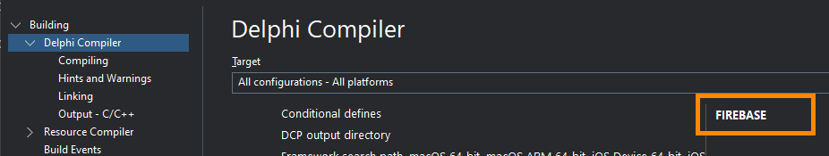
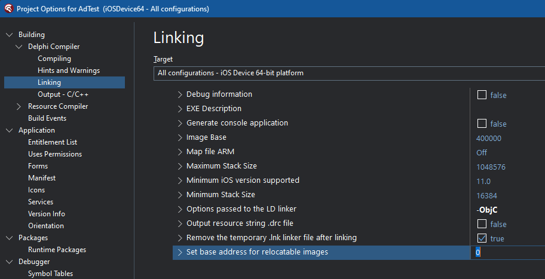
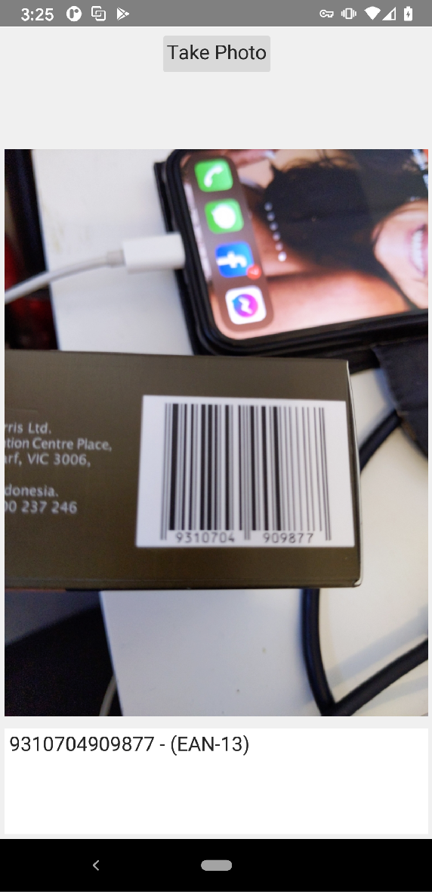

# Barcode reader demo

## Description

This demonstrates the use of the [Google MLVision API to scan barcodes](https://developers.google.com/ml-kit/vision/barcode-scanning/android). 

~~The demo uses a TakePhotoFromCameraAction to capture the image - the code the processes the image to detect barcodes could possibly use images captured "on-the-fly" through video capture.~~

**UPDATE: Due to improvements in TCameraComponent for Android, the demo now uses that for "on-the-fly" detection**

## Supported Delphi versions

Delphi 12, Delphi 11.x. It _should_ also work in Delphi 10.4.2, and perhaps earlier.

## Android 

The following jar files are used by the project:

* play-services-vision-17.0.2.jar
* play-services-vision-common-17.0.2.jar

Both are located in the [`ThirdParty\Android`](https://github.com/DelphiWorlds/Kastri/tree/master/ThirdParty/Android) folder

If you are creating a new project (i.e. other than the demo) you will need to add these jars to the `Libraries` node under the Android platform in Project Manager

**Note**:

Due to a bug in Delphi 11.3 **ONLY**, if you need to compile for Android 64-bit, you will either need to apply [this workaround](https://docs.code-kungfu.com/books/hotfix-113-alexandria/page/fix-jar-libraries-added-to-android-64-bit-platform-target-are-not-compiled) (which will apply to **all** projects), **OR** copy the jar file(s) to _another folder_, and add them to the Libraries node of the Android 64-bit target. (Adding the same `.jar` file(s) to Android 64-bit does _not_ work)

## iOS

If you are combining the Barcode Reader feature with other features dependent on Firebase (such as the FCM demo), add a conditional define of `FIREBASE` in the Delphi Compiler section of the Project Options:

The demo is dependent on prebuilt libraries in the [`ThirdParty\iOS`](https://github.com/DelphiWorlds/Kastri/tree/master/ThirdParty/iOS) folder

The MLKitBarcodeScanning framework is over 100MB, so it has been zipped (`MLKitBarcodeScanning.framework.zip`). **It will need to be unzipped in place, in order for the app to compile**

If you are creating a new project (i.e. other than the demo) in the Project Options, you will need to add the path to the: 

* Framework search path, and:
* Search path

..and ensure you have a value of: `-ObjC` for the `Options passed to the LD linker` option:

 

