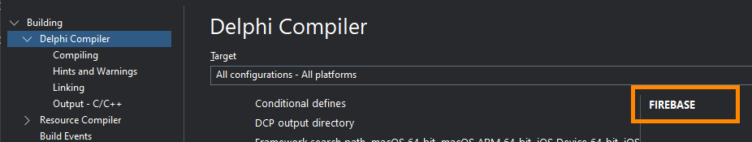
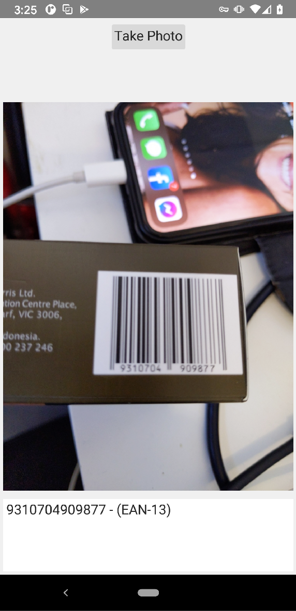

# Barcode Reader Demo

## Description

This project demonstrates how to use the [Google MLVision API](https://developers.google.com/ml-kit/vision/barcode-scanning/android) to scan barcodes.

## Supported Delphi Versions

- **Delphi 12.x**
- **Delphi 11.3** (limited support)

## Project Configuration

Follow these instructions to configure your own project. The demo project has already been preconfigured.

### Android

#### Vision Libraries

The following JAR files are required for the project:

- `play-services-vision-17.0.2.jar`
- `play-services-vision-common-17.0.2.jar`

These files are located in the [`ThirdParty\Android`](https://github.com/DelphiWorlds/Kastri/tree/master/ThirdParty/Android) folder.

Add these JAR files to the **Libraries** node under the Android 32-bit platform in Project Manager.

**Note**: 

For **Delphi 11.3 only**, there is a known issue when compiling for Android 64-bit. To resolve this:
1. Apply [this workaround](https://docs.code-kungfu.com/books/hotfix-113-alexandria/page/fix-jar-libraries-added-to-android-64-bit-platform-target-are-not-compiled), which affects all projects.
2. **OR** copy the JAR files to a different folder and add them to the Libraries node of the Android 64-bit target (adding the same JAR files to both platforms does not work).

#### Manifest Configuration

Modify `AndroidManifest.template.xml` by adding the following line under `<%application-meta-data%>`:

```xml
<meta-data android:name="com.google.android.gms.version" android:value="12451000" />
```

### iOS

#### Firebase iOS SDK

**NOTE: If you are combining the Barcode Reader feature with Firebase Cloud Messaging, see [this section](#barcode-reader-plus-firebase-cloud-messaging).**

The Firebase iOS SDK version you use depends on your Delphi version:

- **Delphi 12.2**: [Firebase iOS SDK 11.2.0](https://github.com/firebase/firebase-ios-sdk/releases/download/11.2.0/Firebase.zip)
- **Delphi 12.1 and earlier**: [Firebase iOS SDK 10.8.0](https://github.com/firebase/firebase-ios-sdk/releases/download/10.8.0/Firebase-10.8.0.zip)

Unzip the SDK to a folder accessible to your projects. Ideally, use a common folder for multiple projects.

Set an [Environment Variable User System Override](https://docwiki.embarcadero.com/RADStudio/Alexandria/en/Environment_Variables) named `Firebase`, pointing to the folder where the SDK is unzipped. This corresponds to the `$(Firebase)` macro in the Project Options. Alternatively, modify the [Framework Search Path](#framework-search-path) to point to the SDK folder.

#### Barcode Reader plus Firebase Cloud Messaging

Due to potential conflicts in compatibility between the official releases of the Firebase iOS SDK and MLKit Barcode Scanning iOS SDK, a [release of pre-built binaries](https://github.com/DelphiWorlds/Binaries/releases/tag/iOS-Arm64-Firebase-Messaging-12.6.0-ML-Kit-Barcode-Scanning-9.0.0-v1.0.0) has been made available in the Binaries repo. 

If using these binaries, unzip the release and in the Project Options for the iOS Device - 64 bit platform:

1. Update the **Framework Search Path** value to the folder where the binaries were unzipped to
2. Remove the `ThirdParty\iOS` folder from the **Search Path** value
3. In the Linker Options, set the Minimum iOS Version value to 15.5, if you wish to avoid linker warnings.

The binaries were built to support iOS 15.5 or higher - at present, there are approximately 5% of devices running less than iOS 16.0

#### Swift Compatibility Libraries

If using Firebase iOS SDK 11.2.0, you must add [Swift Support Files](https://github.com/DelphiWorlds/HowTo/tree/main/Solutions/AddSwiftSupport) via Delphi's SDK Manager.

#### ML Kit Libraries

The Barcode Scanner feature depends on prebuilt libraries located in the [`ThirdParty\iOS`](https://github.com/DelphiWorlds/Kastri/tree/master/ThirdParty/iOS) folder.

The `MLKitBarcodeScanning.framework` is over 100MB and is zipped (`MLKitBarcodeScanning.framework.zip`). **Unzip it in place** to allow the app to compile.

#### Conditional Defines

For projects combining Barcode Reader and Firebase features (e.g., [Kastri FCM](https://github.com/DelphiWorlds/Kastri/tree/master/Demos/FCMRebooted)), add a `FIREBASE` conditional define in the Delphi Compiler section of Project Options:



#### Framework Search Path

Ensure the Framework Search Path includes:

- The `ThirdParty\iOS` folder for ML Kit frameworks
- Framework folders in the Firebase iOS SDK

Example value in the demo:

```
..\..\ThirdParty\iOS;$(Firebase)\FirebaseAnalytics\FBLPromises.xcframework\ios-arm64;$(Firebase)\FirebaseAnalytics\nanoPB.xcframework\ios-arm64;$(Firebase)\FirebaseMessaging\GoogleDataTransport.xcframework\ios-arm64;$(Firebase)\GoogleSignIn\GTMSessionFetcher.xcframework\ios-arm64
```

#### Project Search Path

Ensure the Search Path includes:

- The `ThirdParty\iOS` folder for additional ML Kit binaries
- Dependent Kastri code paths

Example value in the demo:

```
..\..\ThirdParty\iOS;..\..\API;..\..\Core;..\..\Include;..\..\Features\Barcode
```

#### Linker Options

For **Firebase iOS SDK 11.2.0** (Delphi 12.2 or later):
- Set the **Minimum iOS version supported** to: `12.0`.

For **Options passed to the LD linker** for iOS Device 64-bit, use:

```
-ObjC -rpath /usr/lib/swift -weak_library /usr/lib/swift/libswift_Concurrency.dylib -weak_library /usr/lib/swift/libswift_StringProcessing.dylib -weak_library /usr/lib/swift/libswiftDataDetection.dylib -weak_library /usr/lib/swift/libswiftFileProvider.dylib -weak_library /usr/lib/swift/libswiftOSLog.dylib -weak_library /usr/lib/swift/libswiftXPC.dylib
```

These `-weak_library` entries ensure compatibility with iOS 15 or lower.

## Example Scan Result


