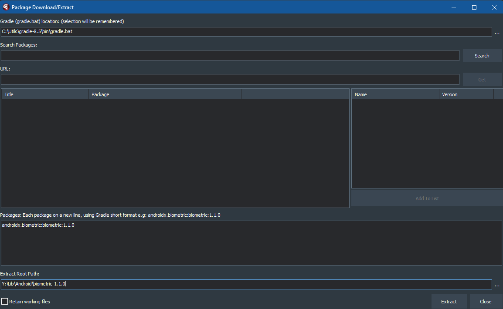
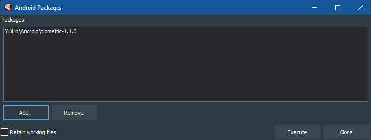

# Biometric Demo

## Description

Implementation of Biometric authentication for Android and iOS

For Android on Delphi 10.4.x, it makes use of [FingerprintManager](https://developer.android.com/reference/android/hardware/fingerprint/FingerprintManager) (now deprecated)

For Android on Delphi 11 and above, it makes use of [BiometricManager](https://developer.android.com/reference/android/hardware/biometrics/BiometricManager). There is _no support for Delphi 10.4.x using BiometricManager_ because it requires the use of [AndroidX](https://developer.android.com/jetpack/androidx), which is not supported in Delphi 10.4.x 

## Biometric Prompt properties

The properties prefixed with `Prompt` (e.g. `PromptDescription`) apply only to **Delphi 11 and above**, and to **Android** only. 

These properties determine what is displayed when the prompt appears, and whether or not confirmation is required (`PromptConfirmationRequired`).

## KeyName property

This property applies only to **Delphi 10.4.x**, to **Android** only, and defaults to the last part of the package name (e.g. `BiometricDemo` in `com.delphiworlds.BiometricDemo`), so you will likely never need to set this property.

## Configuration in your own project

These instructions apply to when you wish to use Biometric support in your own project (i.e. not the demo)

### Dependent jars (Android only)

For Delphi 11.x **ONLY**, you will need to add the dependent jar libraries and disable the corresponding older versions, found in the `Libraries` node under the Android 32-Bit platform target in the Delphi Project Manager.

The jars to be disabled, are:

* fragment-1.0.0.dex.jar
* lifecycle-common-2.0.0.dex.jar
* lifecycle-livedata-2.0.0.dex.jar
* lifecycle-livedata-core-2.0.0.dex.jar
* lifecycle-runtime-2.0.0.dex.jar
* lifecycle-viewmodel-2.0.0.dex.jar

To disable these right-click each jar and click `Disable`

The jars to be added from the `ThirdParty\Android` folder are:

* androidx-activity-1.3.1.jar
* androidx-appcompat-1.0.2.jar
* androidx-biometric-1.1.0.jar
* androidx-savedstate-1.1.0.jar
* lifecycle-common-2.3.1.jar
* lifecycle-livedata-2.3.1.jar
* lifecycle-livedata-core-2.3.1.jar
* lifecycle-runtime-2.3.1.jar
* lifecycle-viewmodel-2.2.0.jar
* lifecycle-viewmodel-savedstate-2.3.1.jar

For Delphi 11.x **AND** Delphi 12.x

The jars to be added from the `Lib` folder are:

* dw-biometric-2.0.0.jar
* dw-kastri-base-2.0.0.jar

To add these, right click the `Libraries` node and click `Add..`, then select the relevant jar file(s)

#### Building the R jar file

Remember: this requirement is for when integrating `TBiometric` into your **OWN** app. *It has already been done in the demo.*

Biometric requires `R` classes associated with the dependent jar files in order to work. When using Android Studio, these are generated automatically; with Delphi, they need to be generated separately. 

This process could be done manually via the command line or in a batch file, however an easier way is through the use of [Codex](https://github.com/DelphiWorlds/Codex). Once you install Codex, you can follow these steps:

1. Build and deploy your project at least once. This step is important for merging the resources Delphi creates, with resources in the Biometric library
2. From the Codex menu in Delphi, in the Android Tools section, use the Download Package function:

   
   
   ..to download/extract biometric-1.1.0, using this value in the Packages edit:

   ```
   androidx.biometric:biometric:1.1.0
   ```

   
   
   ..and click `Extract`

3. Right-click the project in Project Manager, and click `Add Android Package`:
   
   

   ..and add the folder that the package was extracted to in step 2:
   
   

   ..and click `Execute` to build the R classes for `biometric-1.1.0` and add the resulting R jar to the project

   This adds a library with the same name as the project, with an extension of `.R.jar`, to the Libraries node of the Android 32-bit target in Project Manager.
   
4. Rebuild/deploy your project 


### Build Event/Android Manifest

**Delphi 12.1:**

Due to changes in the Android build process:

* **Remove** the Build Events in Project Options for Android 32-bit and Android 64-bit 
* Deploy the project *at least once* - this will create `AndroidManifest.template.xml`
* Modify `AndroidManifest.template.xml` to add *before* the terminating application tag, i.e. `</application>`

  ```
    <activity android:name="com.delphiworlds.kastri.DWBiometricFragmentActivity" 
      android:theme="@style/Theme.AppCompat.Light" 
      android:excludeFromRecents="true" 
      android:exported="false"/>
  ```

**Delphi 12.0 or earlier:**

The Android manifest needs additional entries, and the demo project has a Post-Build event to achieve this:

`..\..\Tools\manifestmerge AndroidManifest.merge.xml $(Platform)\$(Config)\AndroidManifest.xml`

As per this command, `manifestmerge` is found in the `Tools` folder of Kastri. It merges the entries found in the `AndroidManifest.merge.xml` file (in the root of the demo project), with the `AndroidManifest.xml` file which Delphi generates when compiling the project. If your output folder is different from the default (`$(Platform)\$(Config)`) you will need to change this value.


