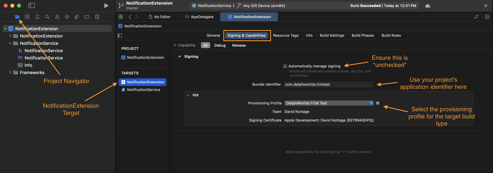
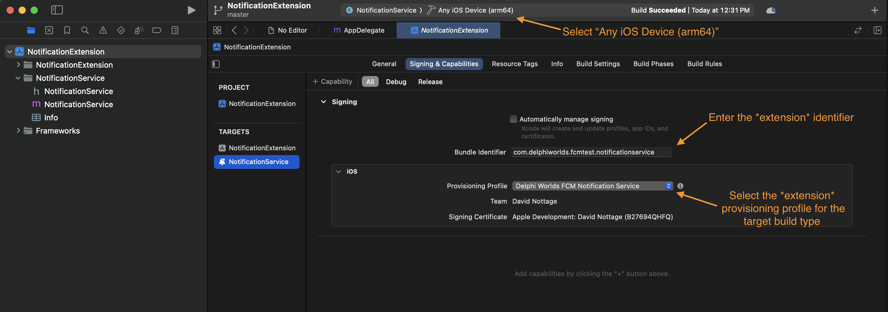
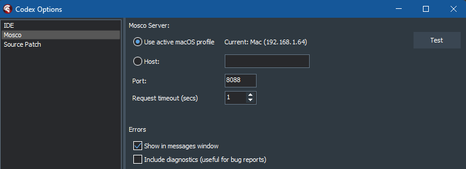
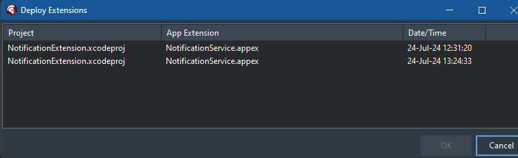
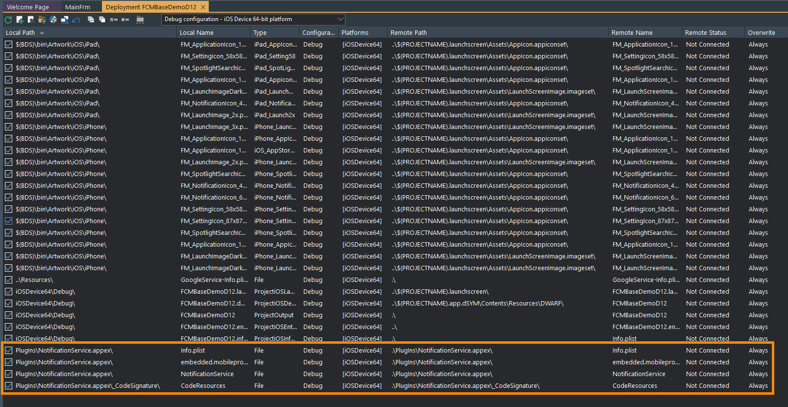

# Support for images in push notifications on iOS

## Introduction

This document describes how to include images in your push notifications on iOS. Note that at present, only **image URLs are supported**.

The process can be a bit of a challenge, so if you become stuck, either [report an issue](https://github.com/DelphiWorlds/Kastri/issues), or join the Delphi Worlds Slack workspace - [this is the self-invite link](https://slack.delphiworlds.com/), and ask your questions there.

## Requirements

* Delphi 12.x
* Xcode (preferably 15.4 or later)
* [Codex 2.4.0](https://www.delphiworlds.com/files/codex/CodexSetup_2.4.0.exe)
* [Mosco 1.7.0](https://www.delphiworlds.com/files/mosco/Mosco.1.7.0.pkg)
* [PushIt](https://github.com/DelphiWorlds/PushIt) (if you plan to use this to send test messages)

## Configuration for the Notification Extension

Extensions for iOS require that the Application ID (or Bundle Identifier) be prefixed by the parent applications identifier, e.g. if your application's identifier is: `com.example.myapp`, the identifier for the extension should be like this: `com.example.myapp.notificationservice`. In this case, `notificationservice` is being used to easily identify the type of extension, however you could use some other suffix.

On the Apple Developer website:

* Create an Application Identifier for the extension as mentioned above. You do not need to select any particular entitlements for it.
* Create Provisioning Profiles for the target build types, e.g. Development and App Store

These will be used when building the Notification Extension project as indicated below.

## Building the Notification Extension in Xcode

* In Xcode, load the Notification Extension project in the `NotificationExtension` subfolder of the `FCMRebooted` demo folder, and select `NotificationExtension.xcodeproj`
* Click the Project Navigator icon in the top left
* Select `NotificationExtension` in the `Targets` list
* Click the `Signing & Capabilities` tab
* Ensure that `Automatically manage signing` is **unchecked**
* Enter your applications Bundle Identifier in the `Bundle Identifier` field
* Select the Provisioning Profile for the target build type, i.e. select a Development profile if you plan on deploying this extension for development, and an App Store profile for App Store
  
  

* Select the `NotificationService` target in the `Targets` list
* Enter your applications **notification extension** Bundle Identifier in the `Bundle Identifier` field, as per the instructions in the [Configuration for the Notification Extension](#configuration-for-the-notification-extension) section
* Select the applications **notification extension** Provisioning Profile (again as per the instructions above) for the target build type
* Select the `Any iOS Device (arm64)` device in the target combo box at the top
  
  

* In the Xcode menu, click `Product | Build` (or Command-B)

Everything being well, this should successfully build the Notification Extension. If not, click the red cross icon at the top to discover why. Remember if you require assistance, you can ask in the Delphi Worlds Slack workspace, as mentioned above.

As Codex/Mosco is being used to manage the Notification Extension, you need not worry about where Xcode generates the binaries for the extension.

**The above step MUST be completed before integrating the extension into Delphi**

## Integrating the extension with Delphi

After you have installed Codex 2.4.0 and Mosco 1.7.0:

* Ensure that Mosco is running on the Mac
* Start Delphi, and note whether the correct version of Codex appears in the splash info
* Ensure that the Mosco options of Codex are configured correctly, e.g.
  
  

* Load the project for which you have FCM support included
* Right-click the project node in Project Manager, and click `Deploy Extensions`
  This should display a window with extensions discovered on the Mac

  

* Select the extension with a Project name of `NotificationExtension.xcodeproj` and the latest date
* Click OK
  
  Codex/Mosco will retrieve the app extension files and place them in a `Plugins` subfolder in the project folder, add the relevant files to the deployment, and show the Deployment Manager:

  

* Build/Deploy the Delphi project
  
  If your **target build type is App Store**, this step will **fail**, however do not despair! You can right-click the project node in Project Manager and click `Rebuild IPA`. Codex/Mosco will build the `.ipa` file on the Mac using the files that Delphi had generated up to the point of failure. If you are interested in *why* Delphi failed, please [read Chris Pimlott's excellent article](https://fmxnative.com/ios-extensions-with-firemonkey) (on which this work is based), specifically the "The trouble with profiles" section.

## Switching from Development to App Store

When you are ready to build your app for App Store, you will need to:

* **Rebuild the Notification Extension Xcode project** using the **App Store** provisioning profiles (instead of Development)
* "Redeploy" the extension to the Delphi project using Codex, as the binaries are copied from the Mac to Delphi
* Redeploy the Delphi project itself. Remember that the deploy will actually *fail*, however you can use the `Rebuild IPA` function of Codex to successfully create the `.ipa` file

## Testing push notification image support

One way of testing images is to use [PushIt](https://github.com/DelphiWorlds/PushIt). There are builds available for Win32 and Win64 (in the Bin folder, but **please do read the readme** regarding required DLLs!), however you can also build it yourself, for Windows or macOS

Either way, the payload for the message needs to have the required members for images in push notifications on iOS to work for **this implementation**. Here's an example:

```json
{
  "message":{
    "topic":"FCMRebooted",
    "notification":{
      "title":"Image Test",
      "body":"This is a test",
      "image":"https:\/\/www.lookslikefilm.com\/wp-content\/uploads\/2019\/08\/Beata-Miro.jpg"
    },
    "android":{
      "notification":{
        "image":"https:\/\/www.lookslikefilm.com\/wp-content\/uploads\/2019\/08\/Beata-Miro.jpg"
      }
    },
    "apns":{
      "payload":{
        "aps":{
          "badge":0,
          "mutable-content":1
        },
        "imageUrl":"https:\/\/www.lookslikefilm.com\/wp-content\/uploads\/2019\/08\/Beata-Miro.jpg"
      }
    }
  }
}
```

The member used by the Notification Extension is `imageUrl`, which is present in the `payload` member - **the location and name of the value are important**.


