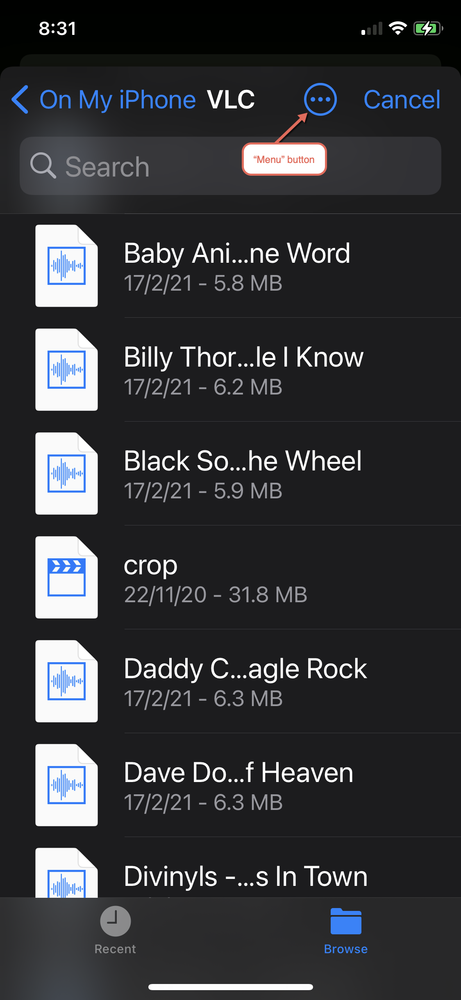
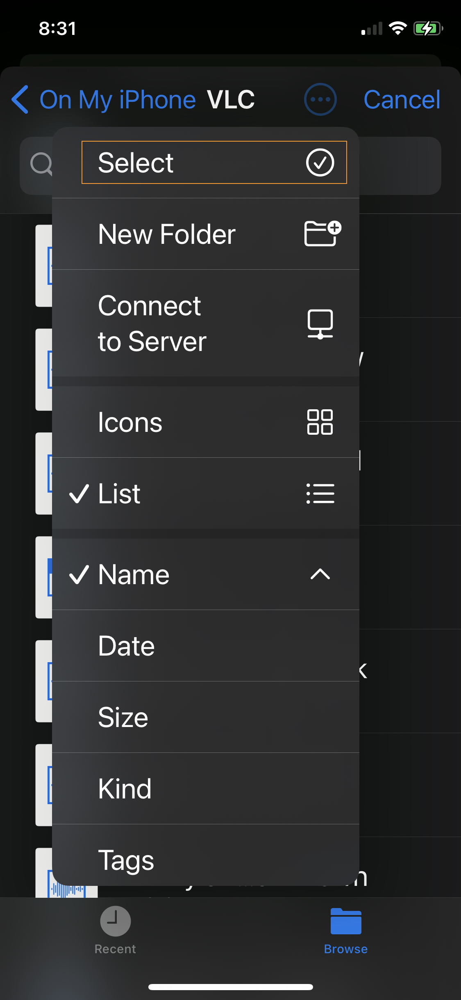
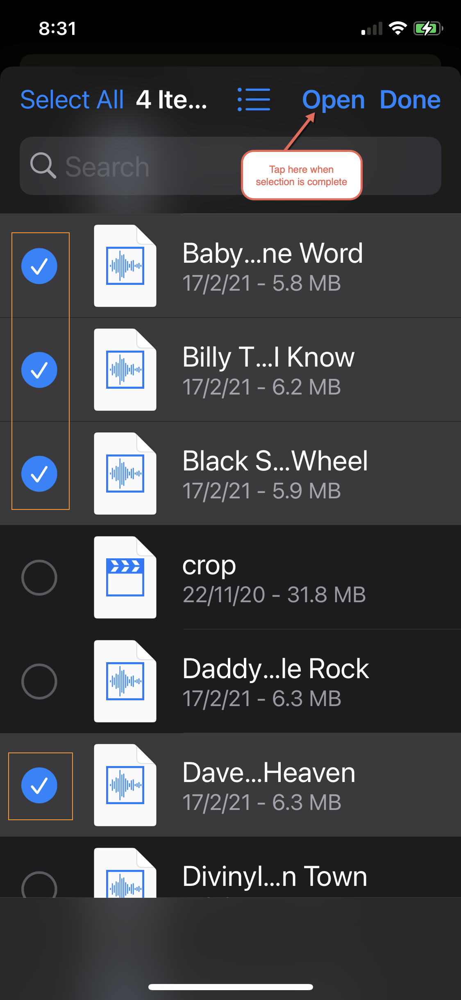

# Files Selector Demo

This demo shows an implementation for the equivalent of TFileOpenDialog, for Android and iOS

## Supported Delphi versions

Delphi 12, Delphi 11.x. It _should_ also work in Delphi 10.4.2, and perhaps earlier.

## Android

On Android, the "file names" returned are not actual file names, however they are references (URIs) that can be used to access the underlying file.

It is necessary to access the files using a [`ContentResolver`](https://developer.android.com/reference/android/content/ContentResolver), by calling the [`openInputStream`](https://developer.android.com/reference/android/content/ContentResolver#openInputStream(android.net.Uri)) method then dealing with the resulting [InputStream](https://developer.android.com/reference/java/io/InputStream). The `RawPath` member of `TSelectedFile` is a string respresentation of the URI.

In [`DW.Android.Helpers`](https://github.com/DelphiWorlds/Kastri/blob/master/Core/DW.Android.Helpers.pas) there is a method of `TAndroidHelperEx` called `ImportFile` that you can use to copy the selected file somewhere, e.g. in the demo code you could do this:

```
  TAndroidHelperEx.ImportFile(FSelector.SelectedFiles[AIndex].RawPath, TPath.Combine(TPath.GetDocumentsPath, FSelector.SelectedFiles[AIndex].DisplayName))
```

Where `AIndex` is the index of one of the files returned in `FSelector.SelectedFiles`

## iOS

On iOS, with the document picker it is not entirely obvious how to make multiple selections. The following screenshots should help:


<br/>
<br/>

<br/>
<br/>

<br/>

When using a value of `[TFileKind.Photo]` for `FileKinds` on iOS, the standard gallery picker will be shown, and images selected will be returned in the `OnImageStream` event, called once for each image. This way developers can choose what they want to do with the stream, e.g. it could be saved as a file, using code like this:

```Pascal
var
  LStream: TMemoryStream;
begin
  LStream := TMemoryStream.Create;
  try
    LStream.CopyFrom(AIMageStream);
    LStream.SaveToFile(TPath.Combine(TPath.GetDocumentsPath, AFileName));
  finally
    LStream.Free;
  end;
end;
```

..or for example the stream could be Base64 encoded using methods from the [`DW.Base64.Helpers`](https://github.com/DelphiWorlds/Kastri/blob/master/Core/DW.Base64.Helpers.pas) unit, such as `TBase64Helper.Encode` or `TBase64Helper.CompressEncode`.
