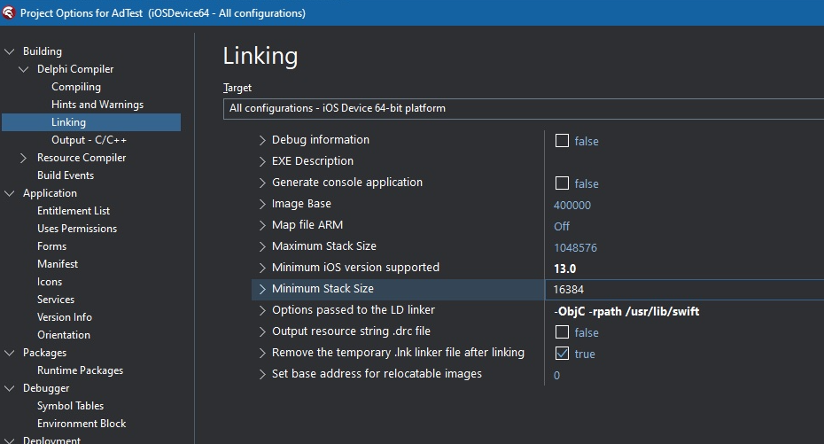

# Firebase Analytics demo

## Description

Demonstrates the Firebase Analytics features implemented in Kastri.

## IMPORTANT

Please read the Android Notes and iOS Notes sections below - they are important for configuration, especially if you are creating your own project and wish to include the Firebase Analytics implementation

## Firebase console setup

You will need to create a project in [Firebase Console](https://console.firebase.google.com/), and add the platforms to the Firebase project you intend to support. 

### Tutorial video

[This video](https://www.youtube.com/watch?v=dRYnm_k3w1w) is a guide for creating/managing Firebase projects. Here are the important sections:

* 2m 31s - Creating the project
* 5m 07s - Analytics is discussed, which is **enabled by default**
* 5m 58s - Adding Android to the Firebase project
* 7m 20s - Since we're using Delphi, just save the `google-services.json` file somewhere convenient, like the root folder of your Delphi project source

The rest of the video can be ignored, since it deals specifically with Android Studio, however if you're going to support Firebase Analytics in iOS, you'll need to add iOS to the Firebase project, which is similar to the steps for adding Android. In this instance, you will need to save the `GoogleService-Info.plist` file. In the demo, Deployment Manager is configured to expect this file in the root folder of the Delphi project.

## Delphi Project setup

### Application identifiers

In Project Options of the Delphi project, select the Version Info section, and select the applicable target. For Android, update the `Package` property to match the package name specified for Android in the Firebase project. For iOS, update the `CFBundleIdentifier` value to match the App ID specified for iOS in the Firebase project.

### Android

#### Import the `google-services.json` file

In Project Options of the Delphi project, select the Services section and select Android as the target. Click the `Import` button and select the `google-services.json` file that was saved earlier. Do this step for Android 32 bit and Android 64 bit if you are targeting both.

#### Entitlements

In the EntitlementList section of Project Options, select the `Receive push notifications` option. This may appear unusual, however it is necessary for the required entries to appear the manifest for Android.

## Android Notes

Official Firebase Analytics support for Android is yet to be added to Delphi (though the foundations are present in Delphi 11), so a couple of "tweaks" are required to make it work.

#### Build Event/Android Manifest

**Delphi 12.1 ONLY**

Please see [this link](../../Delphi12.1.AndroidManifestIssue.md).

**Delphi 12.0 or earlier:**

Configure Build Events in Project Options to add a Post-Build event with the command:  

```
  [kastri]\Tools\manifestmerge AndroidManifest.merge.xml $(Platform)\$(Config)\AndroidManifest.xml
```  
Where `[kastri]` is the path to the Kastri library. Do this for each required Android platform target (i.e. 32-bit and/or 64-bit)

`AndroidManifest.merge.xml` can be found in the root folder of the respective demo (i.e. FCMBaseDemo and FCMRelayDemo), and should be copied to the root folder of your project

### Additional jar files

There are 4 additional jar files added to the project, which are necessary for Firebase Analytics to work. They have already been added to the Kastri repo and the demo has been configured to use them, however when creating your own project you will need to add them to the Libraries node of the Android target in Project Manager. **The rest of the details here are for information only.**

The following 3 were obtained from the [Maven Repository](https://mvnrepository.com/):

* `firebase-iid-21.1.0.jar`
* `play-services-measurement-api.18.0.0.jar`
* `play-services-measurement-impl.18.0.0.jar`

The other file, `play-services-basement-17.6.0.R.jar` is compiled from files in the Android Archive file (`aar`) located [here](https://mvnrepository.com/artifact/com.google.android.gms/play-services-basement/17.6.0)

### iOS

#### Firebase SDK

Firebase support in Kastri has now been aligned with Firebase SDK for iOS version 10.8.0. Firebase SDK versions 9.x and older have now been **deprecated*, and are not guaranteed to work, so support for them has been removed entirely.

Please [download the SDK from here](https://github.com/firebase/firebase-ios-sdk/releases/download/10.8.0/Firebase-10.8.0.zip), and unzip it somewhere, preferably in a folder that can be common to other projects that use the SDK. Create an [Environment Variable User System Override](https://docwiki.embarcadero.com/RADStudio/Alexandria/en/Environment_Variables) called `Firebase`, and set it to the folder where the SDK was unzipped to. This corresponds to the `$(Firebase)` macro in the Project Options of the demo. You can use the framework search path value from the Project Options in your own project.

In order to compile successfully for iOS, it's also necessary to add [Swift Support Files in Delphi's SDK Manager](https://github.com/DelphiWorlds/HowTo/tree/main/Solutions/AddSwiftSupport) (follow the link for instructions)

#### Deployment of GoogleServices-info.plist

Download the `GoogleServices-info.plist` file from your project configured in [Firebase Console](https://console.firebase.google.com/), and save it to the Resources folder in the demo. Add `GoogleServices-info.plist` to the deployment, as per the demo, as described above.

#### Linker Options

Ensure you have a value of: `-ObjC -rpath /usr/lib/swift` for the `Options passed to the LD linker` option in the Project Options for iOS Device 64-bit:

   


