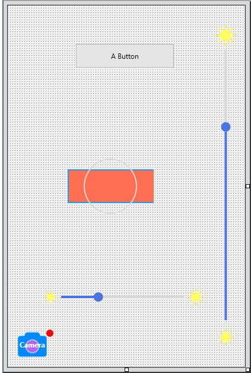
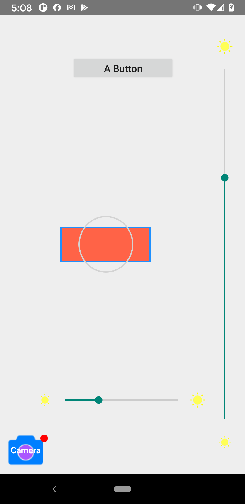
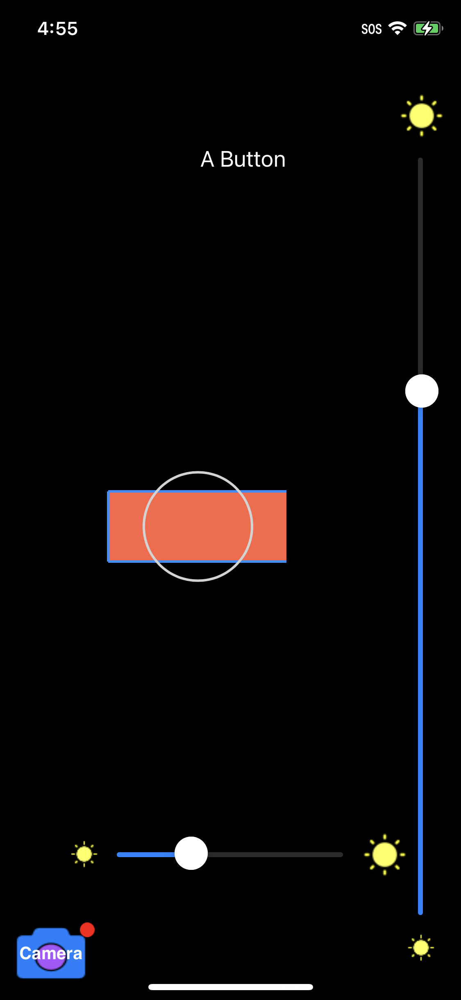

# Kastri Native Controls Demo

## Description

The controls have been created to support proper z-order with other "native" controls supplied with Delphi, such as TMapView and TWebBrowser, i.e. they can overlay the other native controls

Note that at present, most of the controls will function only on Android and iOS, however the controls are rendered in the designer close to what they will look like on the target platform.

Please refer to the [native controls documentation](https://github.com/DelphiWorlds/Kastri/blob/master/Controls/NativeControls.md) for details about the controls themselves, **including installation**

 

## Note about TNativeSlider on Android

As TNativeSlider is based on [SeekBar](https://developer.android.com/reference/android/widget/SeekBar), and it was necessary to create a descendant of the Java class (in order to implement a vertical SeekBar), when creating your own project, you will need to add the base jar for Kastri:

* Delphi 10.4.x and earlier: [dw-kastri-base.jar](https://github.com/DelphiWorlds/Kastri/blob/master/Lib/dw-kastri-base.jar) 
* Delphi 11.x: [dw-kastri-base-2.0.0.jar](https://github.com/DelphiWorlds/Kastri/blob/master/Lib/dw-kastri-base-2.0.0.jar)
* Delphi 12: [dw-kastri-base-3.0.0.jar](https://github.com/DelphiWorlds/Kastri/blob/master/Lib/dw-kastri-base-3.0.0.jar) 

..to the Libraries node under the Android platform in Project Manager in your project. (This is already added in the demos)

## Appearance

Here's how the controls look:

### Design Time

### Android

### iOS

