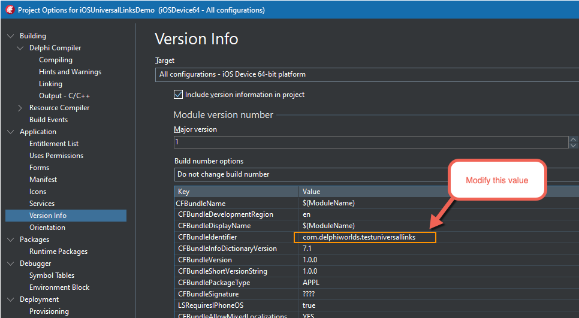
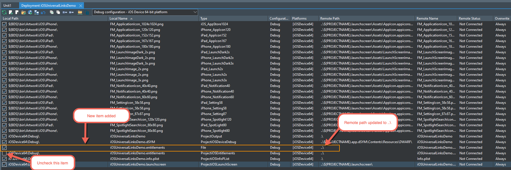

# Universal Links demo (Android and iOS only)

## Description

Demonstrates how users can follow links to content inside the app from a website.

In order to use this demo (and/or implement the feature in your own projects), you will need to follow these steps:

## Set up your website

**Please ensure that your website is capable of handling HTTPS**. This makes configuration far less painful. For iOS, if you are unable to provide https support, please refer to the ["Signing the App-Site-Association File" section in this article](https://developerinsider.co/enable-universal-links-in-ios-app-and-setup-server-for-it/).

### Android: assetlinks.json file

For Android, a file called `assetlinks.json` needs to be added to your website, and needs to be accessible from the `.well-known` subdirectory, e.g: https://yourdomain.com/.well-known/assetlinks.json, as per [this documentation](https://developer.android.com/training/app-links/verify-site-associations#web-assoc).

The file contains information about the package identifier for your app, and a SHA256 fingerprint that is used to associate and an [Android keystore file that you generate via Delphi](http://docwiki.embarcadero.com/RADStudio/Sydney/en/Creating_a_Keystore_File), with your application. As per the documentation mentioned above, you can generate the fingerprint using this command in a commandline window:

```
keytool -list -v -keystore my-release-key.keystore
```

Where `my-release-key.keystore` is the name of the keystore file generated, as explained above. Here's an example of an assetlinks.json file:

```
[{
  "relation": ["delegate_permission/common.handle_all_urls"],
  "target": {
    "namespace": "android_app",
    "package_name": "com.delphiworlds.testuniversallinks",
    "sha256_cert_fingerprints":
    ["AA:BB:07:E3:FE:06:C8:CF:A6:1E:12:3E:7F:87:FF:B7:29:A6:9E:8A:8C:B5:E2:91:AB:CB:86:84:2F:72:AA:BB"]
  }
}]
```

You could use this as a template, replacing the values for `package_name` and `sha256_cert_fingerprints` with your own.

### iOS: apple-app-site-association file

For iOS, a file called `apple-app-site-association` needs to be added to your website. The file is in JSON format (though without the JSON extension - **having no extension is a requirement**), and needs to be accessible from the root of the domain, e.g. https://yourdomain.com/apple-app-site-association, or from the `.well-known` subdirectory, e.g: https://yourdomain.com/.well-known/apple-app-site-association

It contains information about the domain and the supported routes. An [example of the file is here](./Configuration/apple-app-site-association). You will need to modify the file to suit your App ID and the links that will be supported. **Note that the AppID value in this file needs to include the Team ID**

Here is additional [information about setting up a website for Universal Links support](https://developer.apple.com/library/archive/documentation/General/Conceptual/AppSearch/UniversalLinks.html)


### Adding links to your webpage

An example webpage with links (`TestLinks.html`) is located in the [Configuration](./Configuration) folder of this demo, and looks like this:

```
<html>
  <head>
    <title>Universal Links Test</title>
  </head>
  <body>
    <a href="https://www.delphiworlds.com/linkstest"> iOS Links Test</a>
    <br/>
    <a href="https://www.delphiworlds.com/linkstest2">iOS Links Test 2</a>
    <br/>
    <a href="https://www.delphiworlds.com/linkstest2/bloop">iOS Links Test 2 Against "Wildcard"</a>
    <br/>
    <a href="https://www.delphiworlds.com/androidlinkstest">Android Links Test</a>
  </body>
</html>
```

If you use this file to test with, you will of course need to change the `href` values to suit your domain and configuration

## iOS - Apple Developer tasks

[Log in to the website](https://developer.apple.com/account/) with your Apple ID

### App ID 

An App ID with a specific capability is required. If you already have an App ID that you want to add the capability to, see the second set of steps

1. Select Certificates, Identifiers & Profiles
2. Select Identifiers
3. Click the blue "plus" button
4. Click Continue (since this is an App ID)
5. Click Continue (since this is for an App)
6. Give the App ID a meaningful description (such as the name of your app)
7. Enter a Bundle ID as per Apple's recommendation. **This will be used in a later step related to the Delphi project**
8. Select the Associated Domains capability in the list below, as well as any others that the application may need
9. Click Continue
10. Click Register

If you have an existing App ID you want to use, then follow these steps instead:

1. Select Certificates, Identifiers & Profiles
2. Select Identifiers
3. Select the App ID you wish to add the capability to
4. Select the Associated Domains capability in the list below, as well as any others that the application may need
5. Click Save

Note that you will need to recreate any existing Provisioning Profile(s) if you change the capabilities in an App ID

### Provisioning Profile

Once the App ID has been created and configured, you will need to create a provisioning profile, using the App ID:

1. From the Certificates, Identifiers & Profiles menu, click Profiles
2. Select the profile type (e.g. for development, select iOS App Development. The other 2 choices in this scenario are Ad Hoc or App Store)
3. Select the App ID that was created or modified in the above steps and click Continue
4. Select the certificate to be used in the profile and click Continue
5. If this is a Developer or Ad Hoc profile, select the devices to be included and click Continue
6. Give the profile a name and click Generate
7. On your Mac, open Xcode, click the Xcode menu and click Preferences
8. Select the Accounts tab, and select the Apple ID associated with the profile that was created
9. Click the Download Manual Profiles button

The profile should now be on your Mac, in the `~/Library/MobileDevice/Provisioning Profiles` folder (the new file should have the current date and time)

## Delphi Project tasks

### Project Options

1. In the Project Options, select Application > Version Info
2. In the Target combo box, select the configuration to which the options should apply. Unless you have a different App ID for debug and release, select All configurations
3. For iOS, enter the Bundle ID (from step 7 of the App ID instructions) (if this is the demo project, replace the existing value)
4. For Android, enter the package name that applies
5. Click Save, and save the project

    

### Android manifest changes

In order for Android to launch your app in response to the links being browsed to, you will need to add `intent-filter` entries in the `activity` node of the `AndroidManifest.template.xml` file in the project folder.

Following the example from the [`Adding links to your webpage`](#adding-links-to-your-webpage) section, this is what the `activity` node looks like with the `intent-filter` added:

        <activity android:name="com.embarcadero.firemonkey.FMXNativeActivity"
                android:label="%activityLabel%"
                android:configChanges="orientation|keyboard|keyboardHidden|screenSize"
                android:launchMode="singleTask">
            <!-- Tell NativeActivity the name of our .so -->
            <meta-data android:name="android.app.lib_name"
                android:value="%libNameValue%" />
            <intent-filter>  
                <action android:name="android.intent.action.MAIN" />
                <category android:name="android.intent.category.LAUNCHER" />
            </intent-filter>
            <!-- Universal links filters --> 
            <intent-filter android:label="https filter">
                <action android:name="android.intent.action.VIEW" />
                <category android:name="android.intent.category.DEFAULT" />
                <category android:name="android.intent.category.BROWSABLE" />
                <data android:scheme="https"
                      android:host="www.delphiworlds.com"
                      android:pathPrefix="/androidlinkstest" />
            </intent-filter>
        </activity>

### iOS Entitlements

Due to an [issue in Delphi](https://quality.embarcadero.com/browse/RSP-31487), you will need to:

**NOTE: The issue mentioned here has been fixed in Delphi 11.2. If you have this version, you can now add associated domains in the Entitlements List for iOS in the Project Options**

1. Compile the app
2. In the Delphi menu, use Project|Deploy [your project name] (Shift-Ctrl-Alt-F9) to deploy the project files
3. Copy the .entitlements (the file name will start with the same name as your project) file from the deployed files (e.g. in the iOSDevice64\Debug subfolder), and put it in another folder (e.g. the project root)
4. In the copy of the .entitlments file you will need to modify the line below: `<key>com.apple.developer.associated-domains</key>`
5. Replace `<string>*</string>` with:
   

        <array>
          <string>applinks:[yourdomain]</string>
        </array>

    where [yourdomain] is the domain associated with your application, as per the [`Set up your website`](#set-up-your-website) steps, above

6. In the Delphi menu, use Project|Deployment to bring up the Deployment Manager
7. Uncheck the item in the list with a type of `ProjectiOSEntitlements` - it should be the original .entitlements file that was copied in step 3
8. Click the Add button (white rectangle with a little green plus symbol at the bottom) and select the copy of the .entitlements file that has been modified and click Open
9. Modify the Remote Path value for the new item to be: `..\`

    

If you make any changes that result in changes to entitlements, steps 1-5 will need to be repeated

### Build and deploy

Your app should be ready for deployment now, so build and deploy to the device, ready for testing

## Testing the links

On your device where the app has been deployed to, for iOS open Safari, for Android open Chrome, and navigate to the page with links as per the [`Set up your website`](#set-up-your-website) steps

When you tap the link in the browser, your app should open, and the URL passed to the app should match the URL in the link. If the app does not open, check that you have followed the [`Set up your website`](#set-up-your-website) and if on iOS, [`Apple Developer tasks`](#apple-developer-tasks) steps

