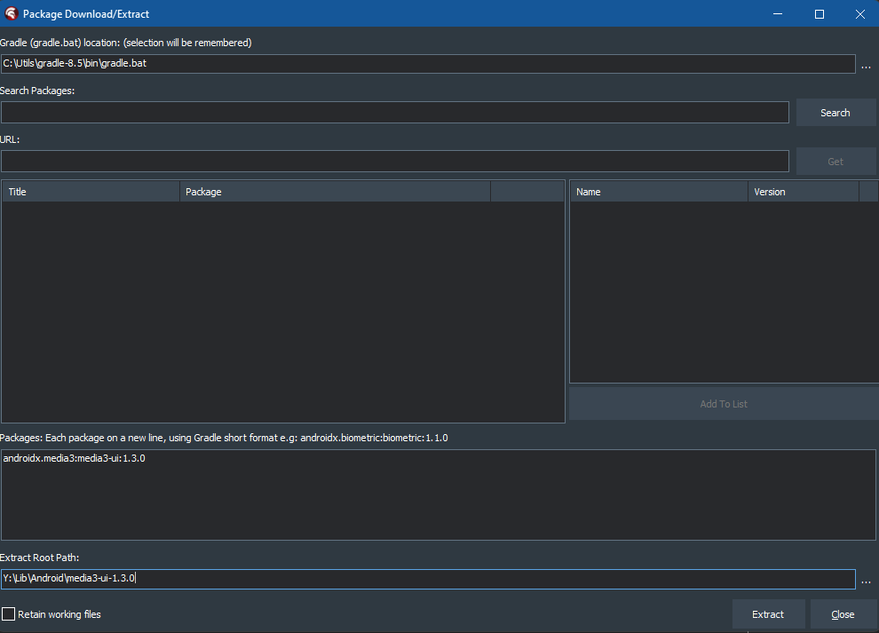
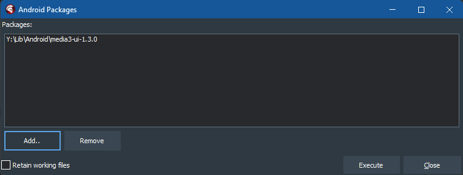

# Video Player Demo

## Description

Demonstrates use of `TVideoPlayer`, which plays video files, or video streams (HLS)

## Supported Delphi versions

Delphi 12.x

## Supported platforms

* Android
* iOS

Support for macOS and Windows is being worked on

## Enhancements/Issues

As always, please use the [issues section of Kastri](https://github.com/DelphiWorlds/Kastri/issues) to request any enhancements and/or report any issues. As well as the additional platform support, there are some enhancements planned including being able to seek to a position in code, read the duration of a video, etc.

## Files/Streams

Example files and streams can be found under the `Resources` folder in the demo. 

### Files

Example files are in the `Videos` folder. The demo has these files added to the respective deployments. For Android, they are added with a `Remote Path` value of `.\assets\internal\Videos`, and for iOS a value of `.\Videos`. The demo uses `TPathHelper.GetResourcesPath` to return the path that the files are deployed to, and reads all the filenames in that folder.

### Streams

The demo reads the `Streams.json` file, which contains information about the title, URL etc for the configured streams. These example streams **should** work regardless of your location, however they have not all been tested for all locations. An example entry is:

```json
  {
    "Channel": "ABC News",
    "Location": "Global",
    "URL": "https:\/\/content.uplynk.com\/channel\/3324f2467c414329b3b0cc5cd987b6be.m3u8",
    "MaxResolution": "720p"
  }
```

Which is for the US-based ABC News channel. You can modify this file to suit your needs, or use your own method for reading stream information.

The streams in the demo `Streams.json` file were sourced from [this m3u list](https://iptv-org.github.io/iptv/countries/int.m3u) in the repo [IPTV](https://github.com/iptv-org/iptv/).

## Using The Demo

Using the demo should be fairly straightforward - the one thing to bear in mind is that once a video has started playing, to return to the files or streams list use the "Back" button on the device.

## Project Configuration

These instructions are for when you are *integrating this feature in your own application*. **The steps have already been performed for the demo**

### Search path for JSON serialization

This demo relies on [NEON](https://github.com/paolo-rossi/delphi-neon) for serialization of JSON in the `Streams.json` file. It has been configured to expect a `User Override` variable named `NEON` that points to the source for NEON.

### Android

#### Streams that use HTTP

If any of the streams use http (none in the demo do), you will need to modify `AndroidManifest.template.xml` to add the following attribute to the `application` node:

```
android:usesCleartextTraffic="true"
```

#### Libraries

You will need to add the required libraries from the `ThirdParty\Android` folder of Kastri, namely:

```
customview-poolingcontainer-1.0.0.jar
failureaccess-1.0.1.jar  - This file needs to be added only if supporting Android 8.x (and perhaps lower)
guava-32.1.3-android.jar
media3-common-1.3.0.jar
media3-container-1.3.0.jar
media3-datasource-1.3.0.jar
media3-decoder-1.3.0.jar
media3-exoplayer-1.3.0.jar
media3-exoplayer-hls-1.3.0.jar
media3-extractor-1.3.0.jar
media3-ui-1.3.0.jar
recyclerview-1.3.0.jar
```

Add these to the `Libraries` node under the `Android 32-bit` target in Project Manager. 

You will also need to **disable** the following jars:

```
listenablefuture-1.0.dex.jar
```

..for **both** `Android 32-bit` **and** `Android 64-bit`

#### Building the R jar file

Remember: this requirement is for when integrating `TVideoPlayer` into your own app. *It has already been done in the demo.*

Media3 UI requires `R` classes associated with `media3-ui-1.3.0.jar` in order to work. When using Android Studio, these are generated automatically; with Delphi, they need to be generated separately. 

This process could be done manually via the command line or in a batch file, however an easier way is through the use of [Codex](https://github.com/DelphiWorlds/Codex). Once you install Codex, you can follow these steps:

1. Build and deploy your project at least once. This step is important for merging the resources Delphi creates, with resources in the Media3 UI library
2. From the Codex menu in Delphi, in the Android Tools section, use the Download Package function:

   
   
   ..to download/extract media3-ui-1.3.0, using this value in the Packages edit:

   ```
   androidx.media3:media3-ui:1.3.0
   ```

   
   
   ..and click `Extract`

3. Right-click the project in Project Manager, and click `Add Android Package`:
   
   

   ..and add the folder that the package was extracted to in step 2:
   
   

   ..and click `Execute` to build the R classes for `media3-ui-1.3.0` and add the resulting R jar to the project

   This adds a library with the same name as the project, with an extension of `.R.jar`, to the Libraries node of the Android 32-bit target in Project Manager.
   
4. Rebuild/deploy your project 

### iOS

#### Streams that use HTTP

If any of the streams use http (none in the demo do), you will need to modify info.plist.TemplateiOS.xml to add the following within the `dict` tag (before the end `</dict>` will do):

```xml
  <key>NSAppTransportSecurity</key>
  <dict>
      <key>NSAllowsArbitraryLoads</key>
      <true/>
  </dict>
```


