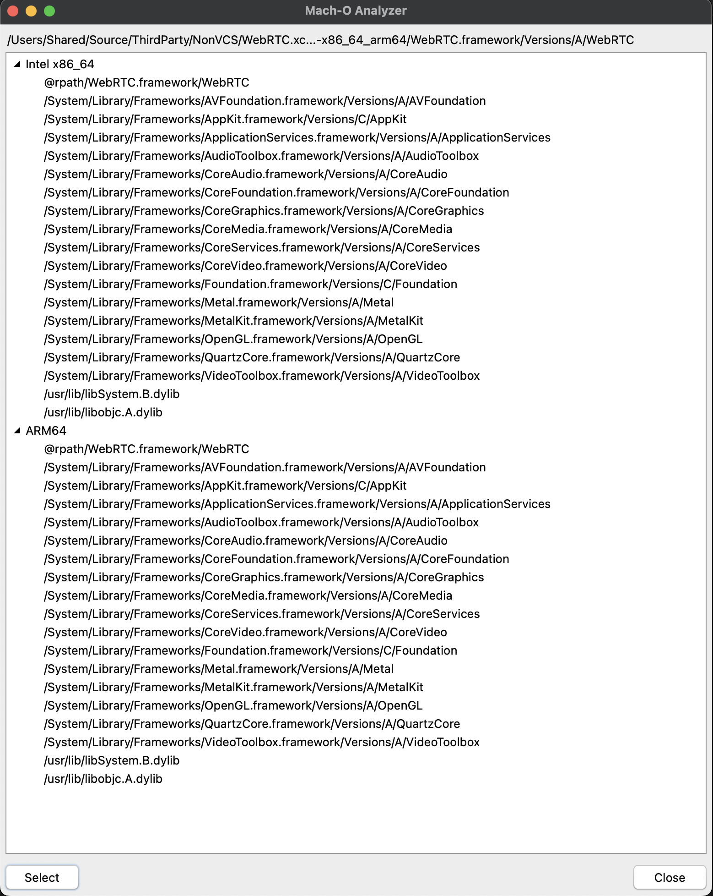

# Mach-O Analyzer (MOA)

## Description

Demonstrates the use of the `TMachOReader` class in the `DW.MachOReader` unit in the `Tools\Core` folder

## Usage

Compile and run the demo on Windows or macOS, click the `Select` button and navigate to a mach-o binary, so such as a 3rd party iOS or macOS framework (usually under a folder ending with `.framework`, the binary named the same as the folder without the extension), and click `Open`. The dependent libraries will appear in the treeview, categorized by the target CPUs.

## TMachOReader

### Purpose

`TMachOReader` was developed primarily in order to be able to analyze mach-o binaries on Windows, instead of running the [`otool` command](https://www.manpagez.com/man/1/otool/) on macOS. It is designed to determine what paths the dependent frameworks need to be deployed to on macOS/iOS, as well as determine what SDK libraries the library being analyzed is dependent on. This functionality was originally intended to be integrated into the Deploy Folder function of [Codex](https://github.com/DelphiWorlds/Codex), however that is still under consideration.

### Enhancements

Please feel free to suggest any enhancements to `TMachOReader` by creating a Feature Request in the [Kastri issues](https://github.com/DelphiWorlds/Kastri/issues) area. Make sure the title of your request begins with [TMachOReader]

## Supported Delphi versions

Delphi 12.x, Delphi 11.x. It may also work in earlier versions

Should compile for Windows, macOS. Not really relevant on other platforms.

## MOA screenshots

This is how MOA looks like on macOS after analyzing the [M105 release of the WebRTC library](https://github.com/stasel/WebRTC/releases/tag/105.0.0) 

## Credits

A **huge** shoutout to [Alex Denisov](https://twitter.com/1101_debian) for his article (and code) on [Parsing Mach-O files](https://lowlevelbits.org/parsing-mach-o-files/) which helped this forward in leaps and bounds.

